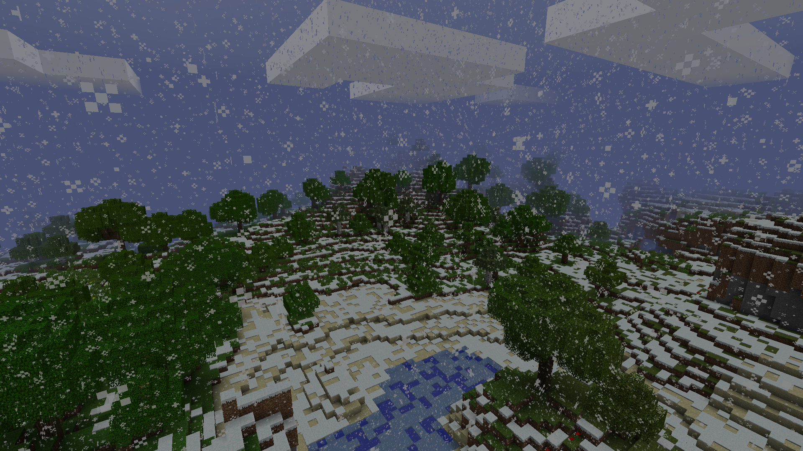

# AlphaWinters

Adds constant snowfall to all overworld biomes, recreating the winter mode from Alpha. Now over 200 downloads... Thank you!

- **Constant snowfall** in all overworld biomes
- **WORLD DAMAGE WARNING** Please backup your world before using. This mod disables rain, and enables constant snowing in all biomes. Water may freeze if no light source nearby, potentially causing damage to your world.

## Compatibility

- **Minecraft Version:** Beta 1.7.3 (client only)

## Screenshots

## Installation

### Method 1: JAR Mod Installation (Manual)

1. **Backup your minecraft.jar** (located in `.minecraft/bin/`)
2. **Download** the latest AlphaWinters release from the [Releases](../../releases)
3. **Open minecraft.jar** with WinRAR, 7-Zip, etc.
4. **Delete** the `META-INF` folder from minecraft.jar
5. **Extract** the mod files and **copy** them into minecraft.jar
6. **Launch** Minecraft.

### Method 2: MultiMC Instance (Recommended)

1. **Download** the pre-configured MultiMC instance from the [Releases](../../releases) tab
2. **Import** the instance into MultiMC
3. **Launch**

## Support

Modrinth: [Link](https://modrinth.com/mod/alphawinters)

If you encounter any issues or have suggestions, please open an issue on this repository.

